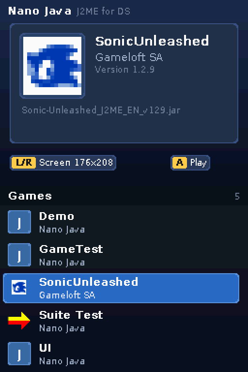
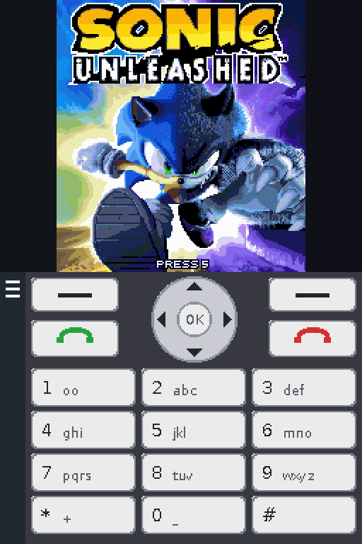
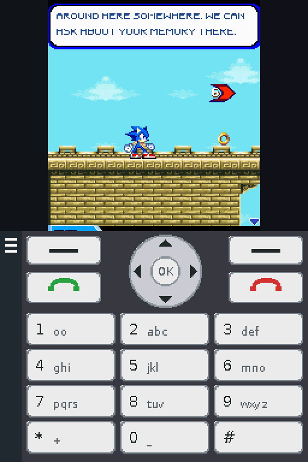
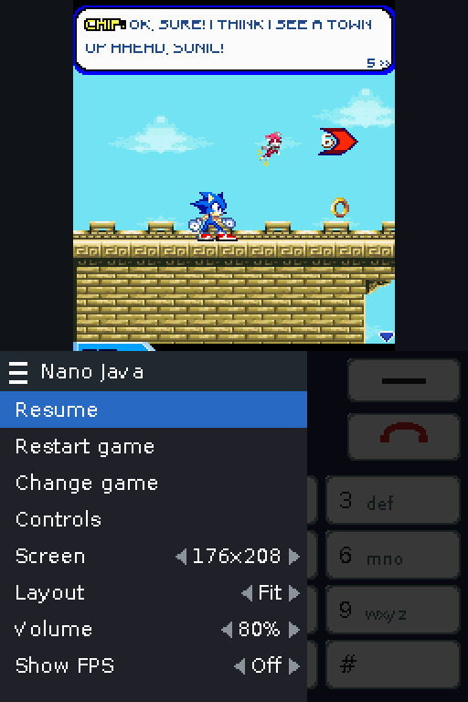
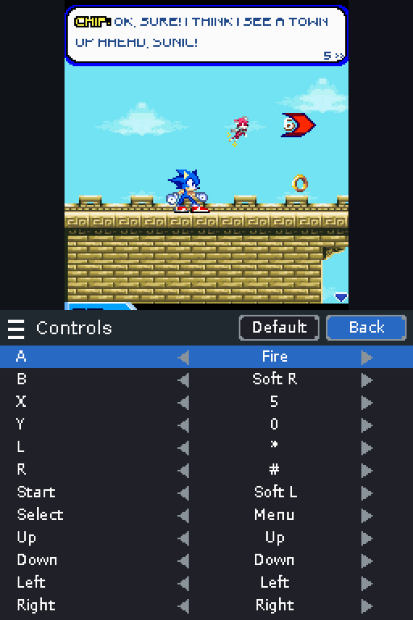
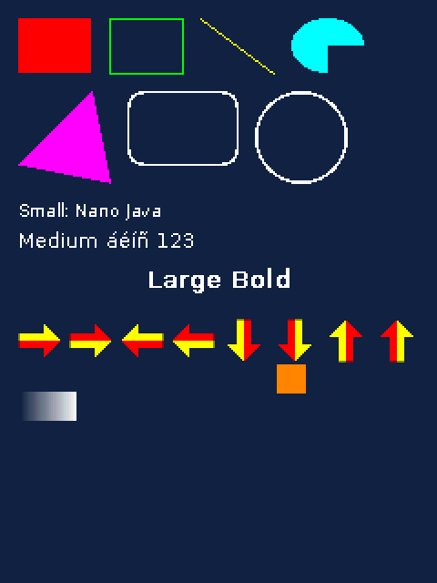
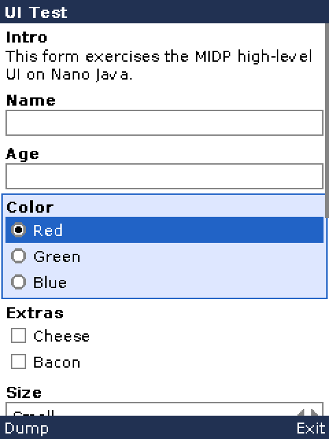

# Nano Java

[](https://github.com/mostazaniikkkk/Nano-Java/actions/workflows/build.yml)

Nano Java runs J2ME games and applications (MIDlets, CLDC 1.1 / MIDP 2.0)
on the Nintendo DS. It is a from-scratch implementation: a small Java
virtual machine in portable C, a class library written mostly in Java, and
a platform layer for the DS (libnds / calico). It needs no third-party
Java code: no KVM, no Sun class libraries.

> Version 2.0 is a complete rewrite. The previous, KVM-based version is
> kept in the [`1.0` branch](https://github.com/mostazaniikkkk/Nano-Java/tree/1.0).

## Screenshots

<table>
  <tr>
    <td align="center"><br>Game list</td>
    <td align="center"><br>Phone keypad on the touch screen</td>
    <td align="center"><br>In game</td>
  </tr>
  <tr>
    <td align="center"><br>Emulator menu</td>
    <td align="center"><br>Per-game controls</td>
    <td align="center">
      
      <br>
      Graphics and high-level UI tests (desktop build)
    </td>
  </tr>
</table>

DS screenshots taken in melonDS. *Sonic Unleashed* is © SEGA / Gameloft and
is shown only to illustrate compatibility; no games are included.

## Download

Get `nanojava.nds` from the
[latest release](https://github.com/mostazaniikkkk/Nano-Java/releases/latest).
Development builds of every commit are available as artifacts of the
[Build workflow](https://github.com/mostazaniikkkk/Nano-Java/actions/workflows/build.yml)
(open a run and download `nanojava`).

## Features

- Java VM: full bytecode set (including `jsr`/`ret` from old compilers),
  green threads with monitors, `wait`/`notify`, `sleep` and `interrupt`,
  exceptions with stack traces, lazy class initialization, weak references,
  a mark & sweep garbage collector.
- CLDC 1.1: `java.lang`, `java.util` (including `Timer`, `Calendar`),
  `java.io`, floating point.
- MIDP 2.0: `Canvas`, `GameCanvas`, `Graphics` (every primitive, the 8
  sprite transforms, alpha blending, `drawRGB`), PNG images, fonts,
  commands and soft keys, the high-level UI (`Form`, `List`, `TextBox`,
  `Alert` and the items), `javax.microedition.lcdui.game`
  (`Sprite`, `TiledLayer`, `LayerManager`), record stores (`rms`),
  `javax.microedition.media` with sound: MIDI music, WAV (PCM, IMA ADPCM,
  u-law, A-law), tone sequences and `Manager.playTone`, played by a
  General MIDI synthesizer that runs on the DS's second CPU (the ARM7),
  `javax.microedition.io` (no networking).
- Nokia UI API (`FullCanvas`, `DirectGraphics`, `DirectUtils`,
  `DeviceControl`, `Sound`), used by many games.
- JAR and JAD files; app properties from the manifest and the JAD.

## Using it on a DS

1. Copy `nanojava.nds` to the SD card and your games (`.jar`, optionally
   with their `.jad`) to `/nanojava/` (also searched: `/java`, `/games`
   and the root).
2. Start `nanojava.nds` and pick a game from the list on the touch screen
   (tap it, or use the D-pad and A). The top screen shows the selected
   game's icon, name, vendor, version and description from its manifest.
   **L/R** changes the phone screen size for that game (240x320 by default;
   saved in `<game>.ini` next to the jar). A jar with several MIDlets asks
   which one to run. A jar with a `.jad` next to it is listed once, using
   the `.jad`'s properties.

The game runs on the top screen (scaled down by the DS hardware when the
phone screen is taller than 192 pixels). The touch screen shows a phone
keypad: the soft keys (labelled with the game's current commands), call
and end, a D-pad with OK, and the number keys.

The tab on the left edge of the touch screen (or SELECT) opens the
emulator menu, which pauses the game:

- **Restart game** / **Change game** (back to the list, no reboot needed)
- **Controls**: map each DS button to any phone key, per game
- **Screen**: the phone screen size (the game restarts to apply it)
- **Layout**: *Fit* (game on the top screen) or *Span* (the game shown 1:1
  across both screens, with a compact keypad below it; touching the game
  sends pointer events)
- **Volume** and **Show FPS** (frames per second and CPU load, shown under
  the menu tab)

Default controls:

| DS | Phone |
|---|---|
| D-pad | Arrow keys |
| A | Fire |
| B | Right soft key |
| X | 5 |
| Y | 0 |
| L | * |
| R | # |
| START | Left soft key |
| SELECT | Emulator menu |

Settings are saved per game in `<game>.ini` next to the jar, and saved
games (record stores) in `/nanojava/rms/`.

## Building

Everything builds inside Docker; you only need Docker installed.

```sh
./build.sh            # Linux / macOS: class library, host build and DS ROM
./build.sh test       # run the test suite
./build.sh nds        # just build/nanojava.nds
./build.sh shell      # a shell in the build container
```

On Windows use `.\build.ps1` with the same arguments. The first run builds
the `nanojava-build` image (devkitARM, gcc, JDK 8) from `docker/Dockerfile`.

Outputs:

- `build/nanojava.nds` - the DS ROM
- `build/classlib.jar` - the class library
- `build/host/nanojava` - a headless desktop build (Linux), used for tests

GitHub Actions runs the same build and the tests on every push
(`.github/workflows/build.yml`). Pushing a tag named `v*` (for example
`v2.0.0`) publishes a release with `nanojava.nds` attached; tags with a
hyphen (`v2.0.0-beta1`) become pre-releases.

## The desktop build

The host build runs the same VM and class library without a window, which
makes it convenient for testing and debugging:

```sh
build/host/nanojava game.jar                         # run a MIDlet
build/host/nanojava --audio-out sound.wav game.jar   # and record its sound
build/host/nanojava --run-ms 5000 --screenshot shot.ppm \
    --keys 1000:-5,1100:-5:up game.jar               # scripted input
build/host/nanojava -cp classes -main MyTest         # a CLDC program
```

`--keys` takes `time_ms:keycode[:up]` entries using MIDP key codes (`-1`
to `-4` arrows, `-5` fire, `-6`/`-7` soft keys, `48`-`57` digits). Run it
with `--help` for all options.

## Tests

`./build.sh test` compiles the programs in `tests/java` and runs them on
the host build, comparing their output with `.expected` files generated
by running the same programs on a standard JVM (`tests/gen_expected.sh`).
Test MIDlets live in `tests/midlets/` (`tests/midlets/build.sh`).

The DS build can be checked in melonDS without hardware. The
`nanojava-emu` image (`docker/Dockerfile.emu`) runs melonDS on a virtual
display; `tools/ds-smoke.sh` presses buttons, taps the touch screen and
saves screenshots, with `build/sdcard` as the SD card:

```sh
docker build -t nanojava-emu -f docker/Dockerfile.emu docker
docker run --rm -v "$PWD":/src -w /src nanojava-emu \
    sh tools/ds-smoke.sh build/nanojava.nds 6:x 20:tap,8,20 3
```

`make nds-embed JAR=game.jar SCREEN=176x208` builds a ROM that starts one
MIDlet directly (no SD card needed) and always shows the FPS counter.

## Project layout

```
src/vm        the virtual machine
src/util      ZIP, inflate and PNG decoding
src/midp      MIDP natives, rasterizer, fonts, input queue, storage
src/pal       platform interface
platform/     host and nds platform layers
classlib/src  the Java class library
tests/        tests and test MIDlets
tools/        font generator, emulator smoke test
docker/       build images
docs/         architecture notes
```

See [docs/ARCHITECTURE.md](docs/ARCHITECTURE.md) for how it works.

## Status and limitations

- The synthesizer uses simple waveforms (one per family of General MIDI
  instruments) rather than sampled instruments; MP3 and AMR are not
  supported (those players run silently but report their events).
- No networking (`Connector.open` fails as on a phone without coverage).
- Fonts are a single family (DejaVu Sans) in three sizes; italic is drawn
  upright.
- Performance depends on the game; the interpreter is a straightforward
  switch-based one.

## License

Nano Java is released under the MIT License (see [LICENSE](LICENSE)). The
built-in font is generated from DejaVu Sans, see
[docs/FONT_LICENSE](docs/FONT_LICENSE).
